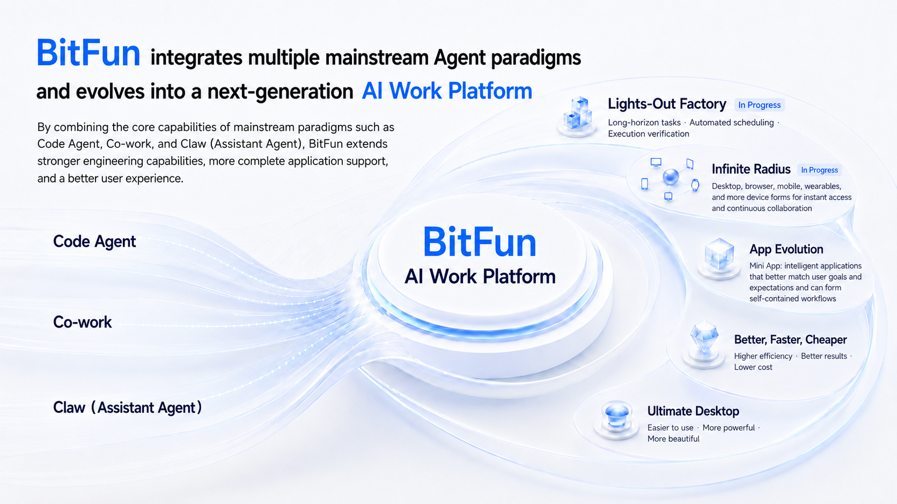

**English**  [中文](README.zh-CN.md)

<div align="center">


</div>
<div align="center">

[](https://trendshift.io/repositories/44672)

[](https://github.com/GCWing/BitFun/releases)
[](https://openbitfun.com/)
[](https://github.com/GCWing/BitFun/blob/main/LICENSE)
[](https://github.com/GCWing/BitFun)

</div>

---

## A New-Generation Foundation for Agentic Applications

BitFun puts the engineering capabilities of the Code Agent at its core and brings together Co-work and Claw (Assistant Agent) for coding, office work, and more real-world scenarios—creating a local-first, new-generation foundation for agentic applications, powered by a Rust-built Agent Runtime and a polished desktop app experience.

- **Lights-Out Factory** (In Progress): Design during the day, let tasks flow to the server and run through the night, then review the results in the morning.
- **Infinite Radius** (In Progress): Extending from desktop and browser to mobile, wearables, and more devices, so work stays accessible and continuous.
- **App Evolution**: Build tailored workflows with custom Agents, MCP, Skills, Mini Apps, or source-level customization. **Community contributors have already created specialized versions for short-form drama, media, and more**.
- **Better, Faster, Cheaper**: Pursue greater efficiency, better results, and lower cost.
- **Ultimate Desktop**: Continuously refine an easier-to-use, more capable, and more beautiful desktop experience.



---

## Agent Core Metrics

The data below evaluates BitFun's core Agent capabilities. All measurements use **Deepseek-V4-Pro** and are grouped into completion results, token economy, and other experience metrics.

> The current numbers are BitFun's initial evaluation results, with each case run once. Benchmarks can fluctuate with task sampling, model versions, runtime environment, and single-run variance, so these scores are meant as an initial sanity signal that the current Agent is already reasonably capable, not as a fixed ranking claim or final ceiling. We will keep optimizing and release full benchmark details later.

### 1. Completion Results

BitFun leads Open Code and Claude Code on both **SWE-Bench-Pro** and **SWE-Bench-Verified**. SWE-Bench-Pro focuses on complex software engineering, while SWE-Bench-Verified focuses on human-verified GitHub issue fixes.


Benchmark references: [SWE-Bench-Pro](https://labs.scale.com/leaderboard/swe_bench_pro_public) / [SWE-Bench-Verified](https://www.swebench.com/verified.html)

### 2. Token Economy

Agent economy needs to be evaluated across end-to-end token consumption, execution time, and KV Cache reuse. The current snapshot first covers KV Cache behavior from the same SWE-Bench-Pro round: BitFun's average KV Cache hit rate was **98.67%**. The follow-up full benchmark report will add the broader cost and latency metrics.


### 3. Other Experience Metrics

Beyond cost, Agent experience also depends on how quickly it can retrieve context in very large engineering projects. For tens-of-millions-line repositories such as Chromium, BitFun uses **flashgrep** to reduce search time by up to about **94.6%**, with an average speedup of about **36.1x**.


---

## Two Core Scenarios, One Extensible Agent Desktop

You can hand two kinds of complex work to BitFun: shipping code in real repositories and turning source material into office deliverables. When a task needs the browser, desktop apps, the terminal, or a remote environment, it can enter the real workspace; when your workflow needs more, you can extend it with custom Agents, MCP, Skills, and Mini Apps.

### Core Scenarios

| Scenario | Delivery goal | Typical capabilities |
| --- | --- | --- |
| **Coding** | Move from a real repository to a mergeable result. | Agentic, Plan, Debug, testing, Git, Deep Review, long-horizon tasks, and benchmarks. |
| **Office Work** | Move from source material to deliverable documents. | Research, PPT, DOCX, XLSX, PDF, summarization, writing, meeting notes, and reports. |

### Shared Capabilities

- **Desktop execution layer**: Computer Use, browser operation, desktop apps, the filesystem, terminals, remote workspaces, and Mini Apps let the Agent enter real work environments.
- **Customization layer**: MCP, Skills, custom Agents, Mini Apps, and source-level extension let BitFun keep growing around your tools, roles, and interfaces.


---

## Ready Out of the Box

### Download directly

Go to [Releases](https://github.com/GCWing/BitFun/releases) to download the latest desktop installer. After installation, configure your model and start using BitFun.

### Run from source

**Prerequisites:**

- [Node.js](https://nodejs.org/) 22.12+ (LTS recommended)
- [pnpm](https://pnpm.io/) 10.15.0 via Corepack
- [Rust toolchain](https://rustup.rs/)
- [Tauri prerequisites](https://v2.tauri.app/start/prerequisites/)

```bash
pnpm install
pnpm run desktop:dev
```

For more development details, see [CONTRIBUTING.md](./CONTRIBUTING.md).

---

## Customize Your BitFun

BitFun's extension paths progress continuously from light to deep customization:

| Tier | Path | Best for |
| --- | --- | --- |
| **L1** | Custom Agent | Defining roles, flows, constraints, and tool bundles. |
| **L2** | MCP / Skills / [Hooks](docs/features/agent-hooks.md) | Connecting external tools and professional capabilities, and running your own commands at Agent lifecycle points — fully Codex-hook compatible, so existing hook scripts work as-is. |
| **L3** | Mini App | Generating dedicated interfaces, forms, panels, or visualizations for tasks. |
| **L4** | Source-level customization | Changing tools, adapters, UI, Runtime, or product shape. |

You can use BitFun's Code Agent to extend BitFun itself.

---

## Contributing

Stars, Issues, and PRs are welcome. We especially care about:

1. Code Agent, Deep Review, debugging, and long-task execution capabilities
2. Cowork, research, document, and desktop workflows
3. MCP, Skills, Mini App, LSP plugins, and new domain Agents
4. Runtime stability, performance, context efficiency, and verifiability

Please submit PRs directly to the `main` branch. For more details, see [CONTRIBUTING.md](./CONTRIBUTING.md).

---

## Disclaimer

1. This project is spare-time exploration and research into next-generation human-machine collaboration, not a commercial profit-making project.
2. This project is 97%+ built through Vibe Coding. Code feedback is welcome, and AI-assisted refactoring and optimization are encouraged.
3. This project depends on and references many open-source projects. Thanks to all open-source authors. **If your rights are affected, please contact us for remediation.**

---
