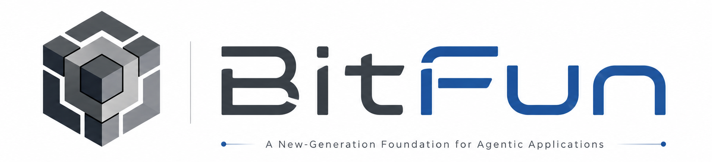
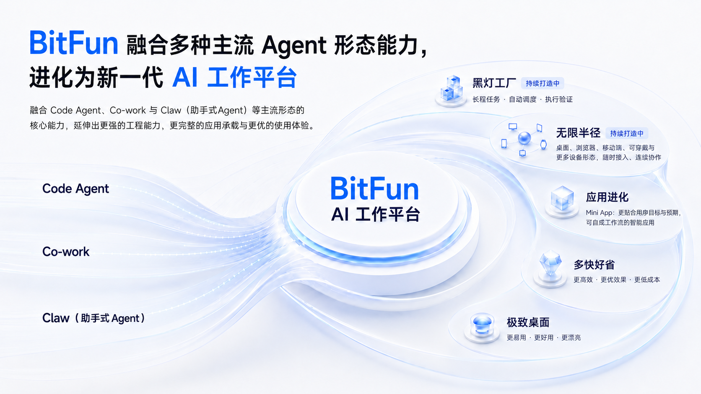
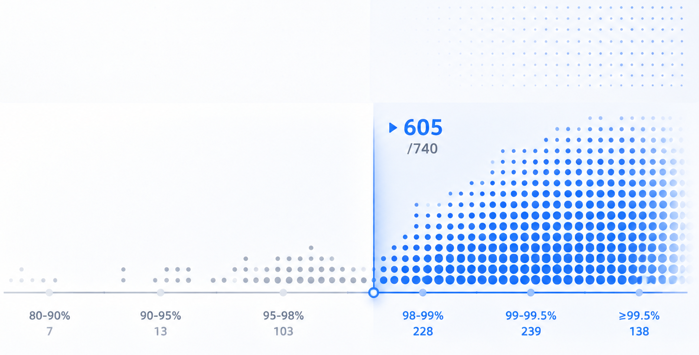
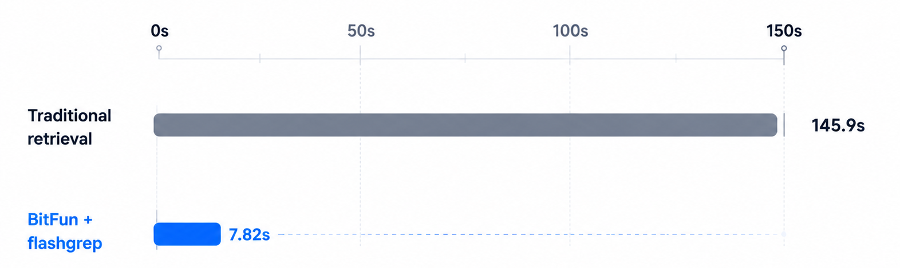

**中文**  [English](README.md)

<div align="center">



</div>
<div align="center">

[](https://trendshift.io/repositories/44672)

[](https://github.com/GCWing/BitFun/releases)
[](https://openbitfun.com/)
[](https://github.com/GCWing/BitFun/blob/main/LICENSE)
[](https://github.com/GCWing/BitFun)

</div>

---

## 融合多种 Agent 形态的新一代 AI 应用底座

BitFun 以 Code Agent 的工程能力为核心，融合 Co-work 与 Claw（助手式 Agent），面向编码、办公和更多真实工作场景，打造本地优先的新一代 Agent 应用底座（含Rust构建的Agent Runtime 和完善的桌面端应用体验）。

- **黑灯工厂**（正在构建中）：白天设计，夜间任务流转到服务器持续执行，早上直接验收成果。
- **无限半径**（正在构建中）：从桌面、浏览器持续延伸到移动端、可穿戴等更多设备，让工作随时接入、连续协作。
- **应用进化**：支持自定义 Agent、MCP、Skills、Mini App 乃至源码级改造，组合专属工作流；**社区伙伴已拓展出短剧、媒体等丰富版本**。
- **多快好省**：追求更高效率、更优效果与更低成本。
- **极致桌面**：持续打磨更易用、更好用、更漂亮的桌面体验。



---

## Agent 核心指标

下面的数据用于观察 BitFun Agent 的核心能力。统一使用 **Deepseek-V4-Pro**，分为完成效果、Token 经济和其他体验指标三个部分。

> 当前数据为每个 case 跑 1 次得到的 BitFun 初始评测结果。评测会受到任务抽样、模型版本、运行环境和单次执行偶然性的影响，存在一定波动；这组数据仅用于说明当前 Agent 已具备可用的基础竞争力，并不代表固定排名或最终上限。后续会持续优化并放出完整评测详情。

### 1. 完成效果

BitFun 在 **SWE-Bench-Pro** 和 **SWE-Bench-Verified** 上均领先 Open Code 与 Claude Code。SWE-Bench-Pro 关注复杂软件工程，SWE-Bench-Verified 关注人工验证的 GitHub issue 修复。


评测集说明：[SWE-Bench-Pro](https://labs.scale.com/leaderboard/swe_bench_pro_public) / [SWE-Bench-Verified](https://www.swebench.com/verified.html)

### 2. Token 经济

Agent 执行是否经济，需要综合评估端到端 Token 消耗、执行耗时和 KV Cache 复用。当前先展示同一轮 SWE-Bench-Pro 中的 KV Cache 观察：BitFun 的平均 KV Cache 命中率为 **98.67%**。后续完整评测会继续补充更完整的成本与耗时指标。



### 3. 其他体验指标

成本之外，Agent 体验还取决于它能否在超大工程里快速找回上下文。面对 Chromium 这类千万行级代码仓库，BitFun 通过 **flashgrep** 最高降低约 **94.6%** 搜索耗时，平均加速约 **36.1x**。



---

## 两个核心场景，一套可扩展 Agent 桌面

你可以把两类复杂工作交给 BitFun 推进：在真实仓库里完成编码交付，在资料和文件中完成办公交付。遇到需要浏览器、桌面软件、终端或远程环境的任务时，它可以进入真实工作现场；需要接入你的工具链时，也可以继续扩展 Agent 自定义、MCP、Skills 和 Mini App。

### 核心场景

| 场景 | 目标交付 | 典型能力 |
| --- | --- | --- |
| **编码** | 从真实仓库推进到可合并结果。 | Agentic、Plan、Debug、测试、Git、Deep Review、长程任务、Benchmark。 |
| **办公** | 从资料推进到可交付文档。 | Research、PPT、DOCX、XLSX、PDF、总结、写作、会议纪要、报告。 |

### 通用能力

- **桌面执行底座**：Computer Use、浏览器操作、桌面应用、文件系统、终端、远程工作区和 Mini App，让 Agent 能进入真实工作环境。
- **可定制化扩展**：MCP、Skills、Agent 自定义、Mini App 和源码级扩展，让 BitFun 可以按你的工具链、角色和界面继续生长。


---

## 开箱即用

### 直接下载

前往 [Releases](https://github.com/GCWing/BitFun/releases) 下载最新桌面端安装包，安装后配置模型即可开始使用。

### 从源码运行

**前置依赖：**

- [Node.js](https://nodejs.org/) 22.12+（推荐 LTS）
- [pnpm](https://pnpm.io/) 10.15.0（建议通过 Corepack 使用）
- [Rust 工具链](https://rustup.rs/)
- [Tauri 前置依赖](https://v2.tauri.app/start/prerequisites/)

```bash
pnpm install
pnpm run desktop:dev
```

更多开发说明见 [CONTRIBUTING_CN.md](./CONTRIBUTING_CN.md)。

---

## 定制你的 BitFun

BitFun 的扩展路径从轻到重连续展开：

| 层级 | 方式 | 适合场景 |
| --- | --- | --- |
| **L1** | Agent 自定义 | 定义角色、流程、约束和工具组合。 |
| **L2** | MCP / Skills / [Hooks](docs/features/agent-hooks.zh-CN.md) | 接入外部工具和专业能力，并在 Agent 生命周期节点运行你自己的命令 —— 完全兼容 Codex Hooks，已有脚本无需适配。 |
| **L3** | Mini App | 为任务生成专属界面、表单、面板或可视化。 |
| **L4** | 源码级改造 | 修改工具、适配器、UI、Runtime 或产品形态。 |

你可以用 BitFun 的 Code Agent 来扩展 BitFun 本身。

---

## 贡献

欢迎 Star、Issue 和 PR。我们尤其关注：

1. Code Agent、Deep Review、调试和长任务执行能力
2. Cowork、调研、文档和桌面工作流
3. MCP、Skills、Mini App、LSP 插件和新领域 Agent
4. Runtime 稳定性、性能、上下文效率和可验证性

请将 PR 直接提交至 `main` 分支。更多说明见 [CONTRIBUTING_CN.md](./CONTRIBUTING_CN.md)。

---

## 声明

1. 本项目为业余时间探索、研究构建下一代人机协同交互，非商用盈利项目。
2. 本项目 97%+ 由 Vibe Coding 完成，代码问题欢迎指正，也欢迎通过 AI 进行重构优化。
3. 本项目依赖和参考了众多开源软件。感谢所有开源作者。如侵犯您的相关权益，请联系我们整改。
