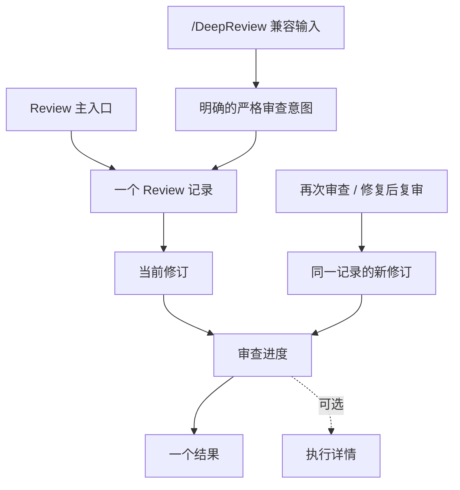

# BitFun 智能体工作流与审查体验产品需求调整提案

> 范围：基于 Bun Rust 迁移文章、Claude Code dynamic workflows、GitHub Copilot cloud agent、Cursor Background Agent / Bugbot、Google Jules 和近期智能体 PR 研究，调整 BitFun 在长任务、并发任务、审查、token 成本和 GUI 交互上的产品需求。
>
> 本文是产品需求层调整，不是技术设计。它回答用户为什么需要这类能力、什么时候应该自动启用、什么时候应该收敛范围或停止、GUI 应如何表达并发，以及 BitFun 如何避免把工作流、证据和审查做成过重流程。

承接文档：

- [agent-workflow-staged-plan.md](agent-workflow-staged-plan.md)：将本文需求压回低风险任务、提交前审查、CI/测试失败、PR 评论批量修复和大规模迁移/审计等真实用户场景；不新增独立阶段路线。
- [architecture/agent-workflow-design.md](architecture/agent-workflow-design.md)：仅作为交互和边界补充，复用既有 Agent Kernel、DeepReview、Harness 和 QDP 契约，不定义新的核心对象模型。
- [../architecture/review-lifecycle.md](../architecture/review-lifecycle.md)：定义 Review 记录、修订、结果投影、过期判断和复审边界；不替代现有 Review 执行器与目标证据契约。

权威边界：本文是候选产品调整提案，不替代 [product-requirements.md](product-requirements.md)、[implementation-plan.md](implementation-plan.md)、[governance/metrics-spec.md](governance/metrics-spec.md) 或 QDP 事件注册表。任何条目被采纳前，必须回填到对应权威文档；未回填前不得作为正式 PRD、阶段承诺、门禁规则或指标口径执行。

2026-07-26 状态说明：

- 已采纳并合入：统一 Review 主入口、DeepReview / ReviewTeam 内部化、小目标普通 Review 单 reviewer、大目标普通 Review 有界受管分批、显式 Strict Review、只读 Reviewer 与 ReviewFixer 分离、同侧栏修复和 follow-up Review。
- 已采纳并实现：移除 PR Review MiniApp 独立路径，PR 面板以固定 provider identity/base/head 和按需 diff 启动统一 Review，并按精确 revision 投影进度、结果和过期状态。
- 已采纳设计、尚未全部实现：一个 Review 记录承载多次修订，后台启动不强制打开内部 child，父任务与 PR 面板读取有界结果投影，问题“本轮是否观察到”和“用户是否处理”保持分离。当前实现仍以 child session 为主要结果身份，不能把目标设计描述成已交付能力。
- 已采纳并实现：普通与严格 Review 由具体未解决问题驱动有界补充检查；内置规则、兼容 Skills 和用户配置的只读审核能力进入同一个内部能力目录，用户仍只看到一个 Review。补充检查绑定明确问题、改动文件范围和证据预期；普通最多两个，严格最多三个且与条件质量检查共用额度，最多并发两个。远程工作区禁用尚不能保证范围隔离的自适应补充检查；历史受管文件包仍按兼容路径执行。
- 已采纳并实现：大目标文件分包与审核维度不成倍扩张；普通零补充检查路径不加载能力目录，补充检查失败不自动重试。现有日志用于离线验证 token、耗时和覆盖，不新增 Review 专用遥测平台。
- 尚未采纳：通用动态 Workflow、CI / 测试失败队列、PR 自动复审策略、自动/inline 评论发布、大规模任务控制台、独立 Verify 产品化和组织级 Review 分析。

## 1. 核心结论

BitFun 后续不应把 dynamic workflow 理解成一个需要用户学习的新模式，也不应把 DeepReview 做成独立且默认沉重的高级入口。更好的产品方向是：

1. **保持默认执行轻量，同时保留完整审核能力**：普通 Review 先由一个只读主审理解改动；只有具体未解决问题才触发有界补充检查。大目标或 provider 证据不完整时仍使用受管工作包，但文件分包与审核维度不得相乘。
2. **把并发能力做成 GUI 中的单一任务控制台**：用户看到的是一个任务、一个进度、一组阶段和异常，而不是 64 个窗口、64 个聊天或 64 条不可理解的日志。
3. **把审查和工作流从概念上后台化**：用户不需要理解 subagent、workflow、evidence pack、artifact graph。Review 默认留在当前任务并形成一个可恢复的结果记录；内部 child 只在查看执行详情或排障时出现。
4. **把完成率、token、耗时做成产品级预算选择**：显式进入严格审查或并发执行时说明预估收益和成本；自动化不能让 token 在用户无感知时暴涨。
5. **把 DeepReview 收敛为 Review 的内部兼容运行时**：显式 Strict Review 用它执行更深证据检查；大目标普通 Review 仅复用其有界 packet 能力，对外仍是普通 L1 Review。
6. **把复杂治理能力收回到用户价值之后**：证据包、图谱、门禁、风险接受是后台支撑，只有在 PR、团队规则、发布、事故、合规或大规模迁移时显性化。

## 2. 业界参照与启发

| 来源 | 先进点 | 对 BitFun 的启发 | 需要避免的误读 |
|---|---|---|---|
| Bun Rust 迁移 | 用动态工作流把超大迁移拆成规则生成、任务队列、并发执行、独立审查、修复回路和强测试 oracle | BitFun 应学习“失败队列化、审查隔离、过程修复、测试真实性确认”，不是只学习并发数量 | 不应鼓励普通任务默认启动大量 agent，也不应把大规模迁移经验泛化到所有改动 |
| Claude Code dynamic workflows | workflow 可由脚本或 SDK 编排，适合批量、动态、可恢复任务 | BitFun 可以把工作流变成后台执行策略，而不是新的用户心智负担 | 不应让用户手写 workflow 才能获得价值 |
| OpenAI Codex Review、Skills 与 subagents | `/review` 提供专用 reviewer；detached review 使用内置 `review-agent`；Skills 可隐式启用；Codex 仓库的 `code-review` 会按可用 `code-review-*` 能力委派独立复核 | 竞品能力应按用户最终获得的组合效果评估，不能只看核心命令。BitFun 应让内置、Skill 和用户审核能力在统一 Review 中按需发挥作用 | 不应把每项能力都默认变成一次完整 Diff 重读，也不应把 Skill 或代理身份暴露为用户必须理解的产品概念 |
| GitHub Copilot cloud agent | 从 issue、dashboard、PR、CI 失败等入口异步启动任务，完成后创建或更新 PR，并请求人工 review | BitFun 应支持从任务、PR、CI、审查意见自然进入后台执行，并保留用户审核点 | 不应把 PR 作为所有任务的默认终点，个人本地任务仍要轻量 |
| GitHub Copilot code review | 自动 PR review、review effort level、可配置自动请求审查 | BitFun 可学习目标集成和人工审核点，但普通 Review 不复制基于启发式风险的多 reviewer 升级 | 不应把“自动审查”误做成无差别门禁或默认 token 放大 |
| Cursor Background Agent / Bugbot | 云端后台 agent、PR 自动审查、发现问题后回到编辑器修复、用 dashboard 展示用量 | BitFun 的 GUI 应围绕“后台任务控制台、异常优先、回到编辑器修复、成本可见”设计 | 不应在 GUI 上复制多终端或多聊天窗口 |
| Google Jules | 异步任务、GitHub 集成、安全云环境、多请求同时处理、用户先审计划和结果 | BitFun 可学习“异步托管任务 + 人类审核点 + 多请求队列”的产品形态 | 不应要求所有长任务都进云端，本地桌面仍是 BitFun 的强项 |
| 智能体 PR 实证研究 | 不同任务类型成功率差异明显，文档和测试更适合 agent，新功能和长期维护风险更高 | BitFun 应按任务类型选择审查强度和预算，不追求单一万能策略 | 不应只用短期合入率衡量成功，还要看返工、维护和 churn |

## 3. 用户核心诉求

用户真正关心的不是 workflow 本身，而是这些结果：

- 任务能不能完成，完成到什么可信度。
- 什么时候需要多花 token 和时间，为什么值得。
- 并发任务现在在做什么，有没有卡住、冲突或越权。
- AI 写出的改动是否经过合适强度的检查，而不是形式上跑了一个重流程。
- 小任务不要被大流程拖慢，大任务不要因为过度简化而失败。
- 高风险动作不要悄悄发生，低风险提示不要反复打断。
- 结果能不能自然变成 PR、验证摘要、审查修复或后续任务。

因此，产品需求应围绕“合适强度、清晰进度、成本可控、结果可信”设计，而不是围绕“工作流数量、subagent 数量、证据模型完整度”设计。

## 4. 产品定位调整

### 4.1 从固定模式改为自适应执行

现有体验容易把 Agentic、Plan、Debug、Review、DeepReview 等理解为不同模式。后续应调整为：

```text
用户表达目标
  -> BitFun 判断任务规模、风险、验证条件和预算
  -> 默认选一个最低足够强度的执行策略
  -> 风险或失败出现时渐进升级
  -> 完成后给出结果、证据摘要和可选后续动作
```

用户可以用自然语言表达“更快”“更稳”或“只看安全”等关注点。当前严格审查只识别 `/review strict`、历史 `/DeepReview` alias 和内部显式 strict follow-up；自然语言 strict 映射若未来接入，必须仍由用户明确表达严格意图，不能由风险启发式规则代替。

上述渐进升级适用于批量执行、失败队列和验证策略。普通 Review 不依据静态风险分数、文件类型或角色表机械增加 reviewer；主审只有在能说明具体未解决问题、预期审核增益和有限证据范围时，才按需调用最多两个补充检查。严格主审遵循同一原则，但最多三个补充检查。用户指定的安全、性能、测试或其他重点优先占用额度。目标超过单 reviewer 证据边界或 provider 证据不完整时，仍使用有界 `ReviewWorker` 工作包；审核重点附着到文件包，不再为每个文件包复制一组补充检查。

### 4.2 DeepReview 收敛为显式 Strict Review

统一的 `Review` 体验只保留两个生产启动边界；内部术语不作为普通用户设置项：

| 内部档位 | 触发条件 | 用户看到什么 |
|---|---|---|
| L1 | 普通 `Review`；主审按具体问题有界复核，大目标内部受管分批 | 一个聚合后的问题清单、证据状态、实际覆盖和残余风险 |
| L3 | `/review strict`、历史 `/DeepReview` alias 或内部显式 strict follow-up | 更完整的调查，必要时使用独立复核；展示覆盖和残余风险，无需例行启动确认 |

L2 只保留历史 manifest 的读取与运行时校验兼容，不产生新的 Review 启动。安全、性能、架构、前端体验、跨模块或验证缺口等能力由主审根据实际问题或用户指定重点动态选择，不通过固定 reviewer 身份表达。文件包只用于超出单主审证据边界的目标，审核重点附着到既有文件包，不复制执行；具体额度、并发和兼容约束由 [DeepReview 架构](../architecture/deep-review.md) 统一定义。

迁移/兼容规则：

- 用户侧唯一主入口是 `Review`。
- `/DeepReview` 只能作为迁移窗口内的历史兼容输入，等价路由到 `Review: Strict`；默认导航、按钮和普通命令不应并列展示 `Review` 与 `DeepReview`。
- child session 和 auxiliary pane 是 Review 内部实现细节；受管 L1 工作包和历史 packet 都不得形成第二个产品入口。如果仍需要用户可见的辅助 pane，必须同步更新 DeepReview 架构文档。
- 普通 review 输出必须合并到同一个 Review 面板，不能再把 DeepReview report 作为另一个窗口或另一个审查结果呈现。

## 5. TUI 与 GUI 的并发心智差异

TUI 用户能接受多个 terminal、多个进程、多个日志，因为核心心智是“我在控制执行”。GUI 用户更期待“系统替我管理复杂度，我只看状态和决策点”。因此 GUI 不应展示多个 agent 实例，而应展示一个任务控制台。

| 并发表达 | TUI 中合理 | GUI 中应如何表达 |
|---|---|---|
| 多个 agent 实例 | 多个 pane、多个命令、多个日志流 | 单一任务卡，显示有多少并行任务正在处理 |
| 大量任务输出 | 用户自己 grep 或翻日志 | 默认聚合，只展示异常、阻塞、关键成果和成本 |
| 任务队列 | 文本列表或脚本输出 | 进度条 + 阶段 lane + 异常卡 + 可下钻任务表 |
| 冲突处理 | 命令行提示或手动 resolve | 明确显示冲突文件、受影响的并行任务和推荐动作 |
| 成本 | 用户看 provider usage 或终端统计 | 任务头常驻 token/time/并发预算 |
| 审查结果 | 固定角色输出拼接 | 主审结论；只有实际委派时才补充独立验证、分歧和未覆盖范围 |
| 手动控制 | kill process、改脚本、重跑 | 暂停、调整范围、停止、保留核心检查、追加预算 |

### 5.1 GUI 并发控制台

大规模任务在 GUI 中应表现为一个“任务控制台”，不是多个聊天窗口：

```text
任务标题：迁移 100 个 crates 到新接口
状态：运行中，42/100 完成，3 个阻塞，预计剩余 18 分钟
执行域：本地工作区 · 写入前询问 · 网络已禁用 · 远程未启用
预算：已用 210k / 500k token，已用 34 / 90 分钟，并发 8 / 12

阶段：
  发现范围        100/100 完成
  生成迁移规则    1/1 完成，已审查
  执行迁移        42/100 完成，55 等待，3 阻塞
  独立审查        18/42 完成，2 个发现
  验证            15/42 完成，1 个失败

需要你决策：
  - crate X 与 crate Y 同时修改 shared contract，建议暂停 Y 等待 X 合并
  - token 预算预计不足，建议低风险 crate 只保留核心检查
```

这个控制台只在大规模任务中显性出现。普通任务不应进入这样的界面。

### 5.2 信息层级

GUI 的默认层级应是：

1. **一句话状态**：正在做什么、是否需要用户决策。
2. **执行域和沙箱状态**：本地/远程/云端、写入范围、网络、凭据和授权状态；该状态只做持续可见提示，不替代安全确认。
3. **阶段摘要**：发现、执行、审查、验证、收敛。
4. **异常优先**：冲突、失败、越权、预算不足、覆盖不足。
5. **成本与预算**：token、耗时、并发、剩余额度。
6. **下钻详情**：每个并行任务的输入、范围、输出、证据和日志。

不要默认展示内部协作过程的推理和完整日志。默认展示完整日志会把 GUI 退化成终端。

## 6. 工作流应服务哪些场景

workflow 不应成为通用默认。它适合满足以下条件的任务：

- 有大量相似 work items，例如 20 个以上文件、crate、测试失败、CI 错误或审查意见。
- 每个 item 可以相对独立处理。
- 有明确 oracle，例如编译、测试、lint、snapshot、diff contract 或人工验收标准。
- 失败可以自动转成队列项。
- 并发收益大于额外协调成本。
- 用户愿意用更多 token 换更高完成率或更短墙钟时间。

| 场景 | workflow 收益 | 默认策略 |
|---|---|---|
| 全仓迁移、跨 crate API 调整 | 高 | 先小样本，再批量队列，再分片审查 |
| CI 大量失败收敛 | 高 | 解析日志成 work items，按失败类型领取 |
| 大规模性能、安全、主题、i18n 审计 | 高 | owner/路径分片，独立审查结论 |
| PR review comments 批量修复 | 中高 | 按评论和文件分组，修复后复核 |
| 单个 bugfix | 低 | 单 agent 或 L1 review |
| 小 UI 调整 | 低 | 主 agent + 必要截图/类型检查 |
| 文档润色 | 低到中 | 默认轻量，只有关键 docs 才加 reviewer |
| 新功能探索 | 不稳定 | 先 plan 和样本，不直接大规模并发 |

## 7. 自动化与上手难度

用户不应先学习 workflow。BitFun 应把 workflow 包装成少数可理解的动作：

| 用户表达 | BitFun 自动映射 |
|---|---|
| “快点改完这个” | 低成本策略，少审查，任务结束给未验证项 |
| “稳一点” | 强调更完整调查和验证；仅当主审形成具体未解决问题时才按普通 Review 额度调用补充检查 |
| “帮我把这批都迁掉” | 先样本迁移和规则确认，再提示是否进入批量 workflow |
| “这个 PR 发出去前严格看一下” | 显式 L3 Strict Review，输出 PR 就绪摘要 |
| “修 CI” | 解析 CI 失败，形成失败队列，逐项修复和验证 |
| “预算有限” | 限制并发和二次审查，优先关键路径 |

自动化可以默认启用，但必须满足三条约束：

1. **成本状态非阻塞呈现**：Review、Strict Review 和受管 L1 工作包直接启动；范围、覆盖、耗时倾向和只读边界在运行状态与结果中展示，不估算底层模型请求或 token。只有特殊异常、权限/安全边界或必须由用户决定的信息才请求确认。
2. **渐进放大**：先抽样或小批量验证，再扩大到全量。
3. **可随时调整范围**：这是长任务和严格审查的候选需求，不是当前启动确认能力；采纳前需补齐具体交互和运行时事实来源。

## 8. Token、耗时和完成率平衡

BitFun 不能把“任务完成率最高”作为唯一目标。用户通常需要的是“在当前成本约束下足够可靠地完成”。

### 8.1 成本倾向信号（非固定模式）

以下是系统从任务和自然语言中识别的倾向，不应实现为要求普通用户预先选择的五个模式，也不应全部进入设置页。

| 用户表达或任务事实 | 用户心智 | 产品行为 |
|---|---|---|
| 快速 | 先给我一个可用结果 | 单 agent 为主，少量验证，明确未验证项 |
| 平衡 | 不要太慢，也别太冒险 | 默认单 agent；显式 Review 使用一个只读主审，只在具体问题需要独立确认时补充检查 |
| 稳妥 | 这个改动重要，宁愿慢一点 | 更完整验证、更强 review、更保守合并 |
| 批量 | 我有大量相似工作 | 队列、并发、抽样、预算面板 |
| 受限 | token 或时间有限 | 限制并发，优先高风险或高价值 item |

### 8.2 升级和停止条件

自动升级应发生在：

- 验证失败且失败类型可分解。
- 发现跨边界影响或权限/安全风险。
- 用户准备 PR 或团队规则要求。
- 小样本成功，用户允许批量处理。
- reviewer 发现阻塞级或重要级问题。

自动停止或收敛范围应发生在：

- 两轮审查没有新增实质问题。
- token 或时间接近预算。
- 失败重复且需要用户信息。
- oracle 不可靠，继续执行只会堆推测。
- workflow 协调成本超过 item 处理成本。

### 8.3 成本可见性要求

大规模任务必须在任务头显示：

- 已用 token；只有存在可靠来源时才显示预计值。
- 已用和预计耗时。
- 当前并发和最大并发。
- 已完成、等待、阻塞、失败和跳过数量。
- 执行位置、沙箱等级、写入范围、网络/凭据状态和授权来源。
- 为什么建议追加预算、调整范围或停止。

小任务不显示复杂成本面板，只在可能超预算时提示。

最低产品契约：

- 默认轻路径不主动显示 token 面板；结束摘要只写已验证、未验证和残余风险。
- 当前显式 Strict Review 与受管 L1 Review 都直接启动；范围、实际覆盖、耗时倾向和只读边界通过非阻塞状态与结果展示，不估算底层模型请求或 token。
- “保留核心检查”、启动前范围调整和停止选项仍是候选需求，不作为当前能力。
- 只有建立可靠成本来源和预算模式后，后续预算说明才可使用估算区间；不得先承诺精确 token。
- 无可靠 oracle、连续两轮无新增有效问题、冲突需要人工信息、或协调成本高于 item 处理成本时，默认建议停止或保留核心检查。

## 9. 隔离审查的产品要求

隔离 reviewer 不只是“开一个 subagent”。产品层应要求四种隔离，但不把这些概念暴露给普通用户：

| 隔离类型 | 用户价值 | 产品呈现 |
|---|---|---|
| 上下文隔离 | reviewer 不被实现者思路带偏 | “已做独立审查” |
| 权限隔离 | reviewer 不能边审边改，降低误操作 | “审查只读，修复需确认” |
| 执行隔离 | 多个并行任务不互相踩文件或状态 | “无冲突 / 有冲突待处理” |
| 模型或角色隔离 | 高风险时获得不受主审结论影响的独立视角 | “主审与独立复核是否一致” |

用户可以手动触发 Review；需要更高检查强度时再显式请求 Strict Review。系统也可以在准备 PR、风险升高、验证失败或团队规则命中时建议合适强度，但静态标签和建议本身不能直接增加 reviewer。普通主审只有形成具体未解决问题、有限证据范围和明确审核增益后，才可以在额度内请求补充检查。

## 10. DeepReview 与普通 Review 合并后的体验

### 10.1 用户入口

保留一个主入口：`Review`。

GUI 只提供 `Review` 主动作。普通目标由一个只读主审负责；具体未解决问题需要独立确认时才补充检查。大目标或 provider 证据不完整时，内部受管执行仍汇总为同一个 Review 结果。用户通过自然语言补充“更快”或“只看安全/性能/架构/前端”等目标时，指定重点优先；当前只有 `/review strict`、历史 `/DeepReview` alias 或内部显式 strict follow-up 进入严格主审路径，不新增可见档位菜单。



用户明确再次审查或完成修复后复审时，应在同一个 Review 记录下新增修订，而不是再制造一个互不关联的结果入口。修订必须重新确认目标和覆盖范围；系统不得仅凭文件列表相似就自动合并两次独立 Review。

不要把 DeepReview 作为用户必须理解的并列产品入口，也不要在普通设置中暴露内部专家池或 Judge。

兼容要求：

- 既有 `/DeepReview` 可以继续存在，但只能文案化为迁移窗口内的历史兼容输入，等价路由到 “Review: Strict”。
- 如果一个场景从 `/DeepReview` 启动，用户仍应回到统一 Review 记录读取聚合结果。
- DeepReview 的 child session 和 auxiliary pane 不应成为普通用户的第二套窗口模型；默认启动不应强制打开内部 child。用户主动查看执行详情或排障时，空内容必须解释为准备中、加载中或加载失败，不能只显示标题和空白主体。

### 10.2 输出形态

审查输出应按问题优先，而不是按 reviewer 输出拼接：

```text
结论：建议先修 2 个问题再提交

高优先级问题：
  1. ...
  2. ...

建议确认：
  1. ...

已覆盖：
  - 业务逻辑
  - 权限边界
  - 性能热点

未覆盖：
  - 没有运行端到端测试，因为 ...

下一步：
  - 应用修复
  - 修复后快速复审
  - 复制 PR 就绪摘要
```

同一个 Review 记录的最新修订应作为主结果，并同时显示目标、覆盖状态和新鲜度。历史修订可以查看，但不能与当前结果并列制造多个“结论”。“未发现可操作问题”必须附带覆盖说明，不能写成“通过”或“可以安全合并”。

跨修订的问题状态分为两个维度：系统只描述 `新增 / 重复 / 变化 / 本轮未观察到`，用户才可以明确标记 `未处理 / 已解决 / 已忽略`。本轮未再次出现的问题不能自动视为已解决。

### 10.3 范围收敛要求

普通 Review 不根据静态规模、风险分数或文件类型机械增加审核维度。系统准备可靠的目标证据，并让一个主审决定调查深度；主审只有形成具体问题、有限范围和明确预期增益时才调用补充检查。目标超出单主审证据边界时，用有界内部工作包补齐覆盖：

- 小目标由一个主审负责，必要时补充检查；大目标或 provider 证据不完整时使用有界内部工作包。两者的选择门槛和执行上限由 [DeepReview 架构](../architecture/deep-review.md) 定义，对外始终是一个 Review 记录和一个聚合结果。
- 缺少足够上下文或 oracle 时明确限制结论，不用额外 reviewer 掩盖证据不足。
- provider 容量不足时不静默增加重试或 reviewer。
- 用户显式选择严格审查后，展示更完整覆盖、必要独立复核、通常更长耗时和只读边界；内部调用额度不作为普通用户必须理解的产品概念，底层模型请求与 Token 不做估算，范围调整与停止选项保留为候选需求。
- 本地修复范围能够被可靠归因时，复审可以检查原范围与实际改动文件；命令或 Git 操作导致变更来源不确定时，必须明确回退到当前工作区完整目标。
- PR provider 当前只能可靠给出重新确认后的完整 base/head 目标，因此 PR 复审应检查当前完整 PR，再比较相邻修订的问题结果；在没有跨 provider 的任意 revision delta 契约前，不得宣传为节省 Token 的增量 diff 审查。

## 11. 过度设计和过度审核的防线

BitFun 的优势不应表现为“每一步都有重流程”，而应表现为“该轻则轻，该重则重”。

### 11.1 不应默认做的事

- 不应默认为每个任务生成完整 evidence pack。
- 不应因风险标签、文件类型或可用能力数量默认启动多个 reviewer；补充检查必须对应具体问题和有限范围，有界受管工作包只用于超出单主审证据边界的目标。
- 不应默认把所有任务都推到 PR 或云端。
- 不应默认暴露 artifact graph、policy profile、workflow DSL。
- 不应把模型建议升级成阻断。
- 不应因为能并发就并发。
- 不应把“严格审查”包装成用户无法跳过的产品姿态，除非安全或组织策略要求。

### 11.2 应默认做的事

- 给出短任务摘要。
- 标明已验证和未验证。
- 对高风险动作做清晰安全确认。
- 在准备 PR 或风险升高时建议合适强度审查。
- 超成本前确认。
- 失败后解释能继续做什么，而不是只显示失败。
- 把复杂证据后台保留，在需要时投影。

## 12. 剩余候选产品调整议题

统一 Review 入口、只读审查与修复分离已经成为当前基线，不再重复列为候选。下表只保留尚未采纳的议题，不是正式 PRD 编号。采纳任一议题前，必须合并到 [product-requirements.md](product-requirements.md)，并按需要同步 [implementation-plan.md](implementation-plan.md)、[governance/metrics-spec.md](governance/metrics-spec.md) 和 QDP 事件注册表。

| 编号 | 调整项 | 采纳条件 |
|---|---|---|
| WF-CAND-02 | 轻路径保护 | 低风险任务仍默认单 agent、无 workflow UI、无默认 reviewer，且首次有用结果不被拉长 |
| WF-CAND-03 | 成本确认 | 已定义预算触发、估算展示、范围控制动作和停止条件，并不会把成本面板带入小任务 |
| WF-CAND-04 | 场景化 workflow | 仅 CI/测试失败、PR 评论批量修复、大规模迁移/审计等明确场景进入队列或并发 |
| WF-CAND-05 | 单一 GUI 任务控制台 | 批量任务只显示一个控制台，并固定展示执行域、沙箱状态、异常、预算和可下钻详情 |
| WF-CAND-07 | 样本和 oracle 优先 | 大规模自动化必须先样本验证；没有可靠 oracle 或人工验收标准时不得扩大执行 |
| WF-CAND-08 | 可调整范围和可收敛 | 长任务必须支持暂停、停止、保留核心检查、跳过低优先项和保留已完成结果 |

## 13. 指标治理调整

本文只提出 workflow 视角下的指标保护 lens，不新增正式指标口径。正式采纳前必须补齐 metrics spec 的负责人、分母、窗口、数据来源、阶段和解释边界；需要新事件时还必须进入 QDP 事件注册表。

| 候选观察项 | 说明 | 治理要求 |
|---|---|---|
| 首个有用结果时间 | 小任务是否仍然快，防止默认路径被 review/workflow 拖慢 | 映射到既有速度指标或补充 metrics spec |
| 用户打断率 / 弹窗触发率 | 成本确认和审查提示是否打扰默认路径 | 复用既有弱提示和弹窗降噪指标 |
| 成本预期偏差 | 用户事后是否认为 token 或耗时超出预期 | 需要定义预算模式、分母和采样方式后才可采纳 |
| 任务解决率 | 当前成本约束下用户目标是否实际完成 | 需要定义任务类型、完成判定和人工反馈来源 |
| 审查有效问题率 | reviewer 发现的问题中，最终被用户、测试或后续修复确认的占比 | 需要 review feedback 事件稳定后进入 P2+，不能作为 P0 默认门禁 |
| 队列阻塞率 | 批量任务中阻塞、冲突、跳过的分布 | 仅真实批量场景稳定后采纳 |
| 后续返工率 / churn | 合入或完成后因 AI 改动导致返工或大幅修改的比例 | 仅长期回放和维护分析采纳 |

## 14. 采纳方式

这不是新的 P0-P4 路线。若采纳本文方向，应该按以下方式回填到既有路线：

- 低风险任务轻路径、已验证/未验证摘要和用户显式 L1 快审，回填到既有 P0/P1 的低摩擦体验，不默认进入 PR 审查。
- PR、受保护分支和团队规则场景，回填到既有 P2 的 PR/团队治理路径；P1 最多做 shadow/advisory，不形成默认阻断。
- CI/测试失败和 PR comments 批量修复，只有在已有 long-running task queue、取消/恢复、执行域提示和成本确认可用后，才回填到 P1/P2 对应场景。
- 大规模迁移/审计必须等样本 gate、oracle、预算确认、冲突处理和回放指标稳定后，再回填到 P3 复杂生命周期场景。
- 指标只在 metrics spec 和 QDP 注册表补齐后采纳；未补齐前只能作为调研观察项。

## 15. 参考资料

- [Bun: Rewriting Bun in Rust](https://bun.com/blog/bun-in-rust)
- [Claude Code workflows](https://code.claude.com/docs/en/workflows)
- [OpenAI Codex code review](https://learn.chatgpt.com/docs/code-review)
- [OpenAI Codex skills](https://learn.chatgpt.com/docs/build-skills)
- [OpenAI Codex review task implementation](https://github.com/openai/codex/blob/61a44880a85d2fd0d8770908dea5733495e571c8/codex-rs/core/src/tasks/review.rs)
- [OpenAI Codex detached review request path](https://github.com/openai/codex/blob/61a44880a85d2fd0d8770908dea5733495e571c8/codex-rs/app-server/src/request_processors/turn_processor.rs)
- [OpenAI Codex bundled review-agent Skill](https://github.com/openai/codex/blob/61a44880a85d2fd0d8770908dea5733495e571c8/codex-rs/skills/src/assets/samples/review-agent/SKILL.md)
- [OpenAI Codex repository review orchestrator](https://github.com/openai/codex/blob/61a44880a85d2fd0d8770908dea5733495e571c8/.codex/skills/code-review/SKILL.md)
- [GitHub Copilot cloud agent: starting sessions](https://docs.github.com/en/copilot/how-tos/use-copilot-agents/cloud-agent/start-copilot-sessions)
- [GitHub Copilot cloud agent on GitHub](https://docs.github.com/en/copilot/how-tos/use-copilot-agents/cloud-agent/use-cloud-agent-on-github)
- [GitHub Copilot automatic code review](https://docs.github.com/en/copilot/how-tos/copilot-on-github/set-up-copilot/configure-automatic-review)
- [Cursor 1.0: Bugbot, Background Agent, MCP](https://cursor.com/changelog/1-0)
- [Cursor Cloud Agents](https://cursor.com/docs/cloud-agent)
- [Google Jules](https://jules.google/)
- [Google Jules public beta announcement](https://blog.google/innovation-and-ai/models-and-research/google-labs/jules/)
- [Comparing AI Coding Agents: A Task-Stratified Analysis of Pull Request Acceptance](https://arxiv.org/abs/2602.08915)
- [On the Use of Agentic Coding: An Empirical Study of Pull Requests on GitHub](https://arxiv.org/abs/2509.14745)
- [Investigating Autonomous Agent Contributions in the Wild](https://arxiv.org/abs/2604.00917)
